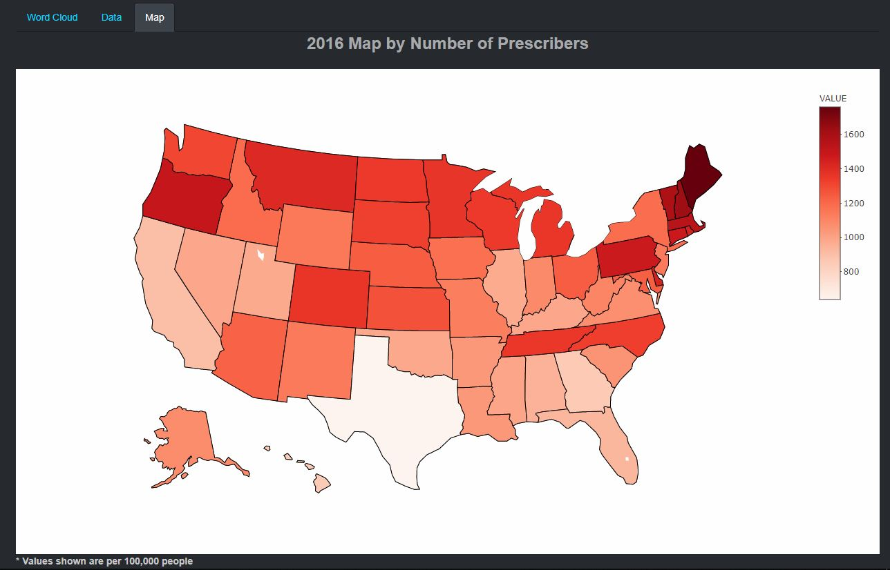
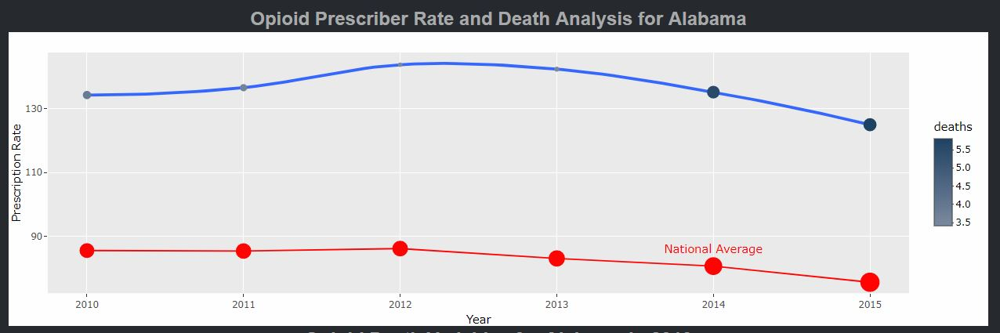
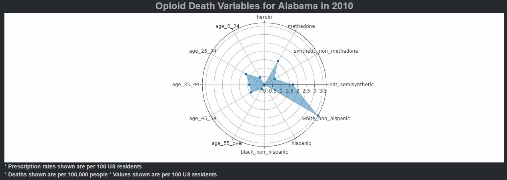
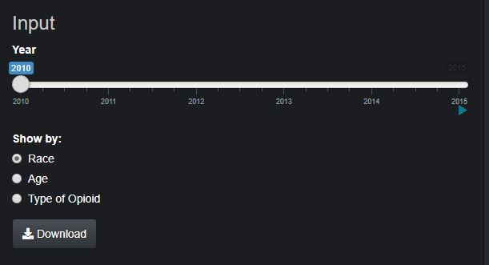

# Visual Encoding and Interaction Design

## Visual Encoding

Our data is centered around visualizing data for the United States for a researcher. Based on this we decided to encode our data in the form of a map visualization in order to allow the user to see how data changes from state to state and see patterns in different regions of the country. The values are encoded based on the variable selected using a choropleth mapping style that shades each state based on their value with lower values typically being lighter and transitioning to darker colors for higher values.

+   

As part of the data characterization, we felt it was important to identify which opioids were used the most based on different variables. To provide this information to the user we developed a word cloud visualization. The most recorded opioids are displayed larger than the lower values which scale down in order of frequency, so it becomes clear to the user which opioids are used the most.

+   

As part of the final analysis, we wanted to identify the relationship between the prescription rates and deaths. To do this we decided to present the user with a summary for each state throughout the years provided in the form of a line plot showing the prescription rate on the Y axis and each year on the X axis. We encoded the death rates as points where both the size and color change based on their values. We also felt it was necessary to have a reference to the national data to assess the states condition overall, so we created the same type of visualization in the same plot only with the national data.  This allows the user to assess if the death rate per state falls above or below the national average.

+   

Another question we wanted to try to answer were what factors contributed to opioid deaths. We wanted to show the different variables we collected all together in one plot using a radar plot to see which variables stand out and how they form a relationship with one another and change over time as seen in the example below. This can help identify which demographics need attention and can be used as an aid to develop a focused action plan.

+   

## Interaction Design

The application has information for the entire United States so one key interaction to be implemented for the user was the ability to select a state or show data nationally. In most datasets we collected data for different years so a user can see how data changes from year to year. To do this, we implemented a slider so the user can navigate through the data, and we also allow the user to start an animation to cycle through the years so the user can focus on the visualization and see how the data changes. Some of our datasets have different variables that we deem important, but may take away from the visualization if shown all together. We implemented radio buttons so that the user can select a variable to display it on the visualization. We also give the user the option to change the format in certain sections of our visualizations. To do this we created tab panels that allow the user to click on a panel to see the data in multiple formats such as a map and data grid.

Lastly, with this application being designed as a research tool, we wanted a way for users to take our visualization out of the application and into their research environment whether that is in a report or a presentation. To implement this, we added a download button in all of the data tables. The Download button is conditionally available only when the user is in the data tab and is accessible by simply clicking the Download button at which point the export will be downloaded to the user’s computer. One benefit of using Plotly is that it comes with an option to export the plot by default, so all our Plotly based visualizations can easily be downloaded as an image.

+   
