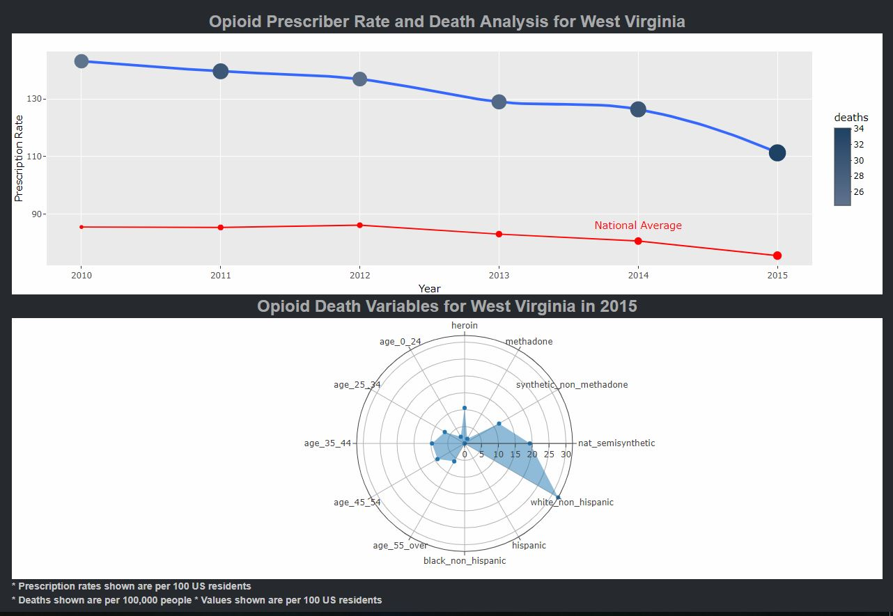

# User evaluation

## Who is the User?
As mentioned in the previous section of our report the application is being modeled as a tool for researchers looking for more insight to aid in their research into opioids.  The app is designed so that it includes all information we have for all 50 states and Washington DC. With that being said the application usage could expand to be used by different State departments  such as Health and Human Services to see what areas to focus on when developing opioid action plans. One example, is the NC Department of Health and Human Services currently has an ongoing project called the Opioid Action Plan Implementation Initiative. They may find this application useful.

## Using the Application
The application is designed so that each section provides insight into different factors of the opioid epidemic and is summarised in the analysis tab.  When forming an action plan for the opioid crisis, one question researchers and public policy officials may have is whether the drugs identified as the addictive substance and/or the cause of the overdose are drugs that can be legally prescribed, such as oxycodone or percocet, or if they are illegal drugs such as heroin. We believe the answer to this question would help them choose how to utilize resources and focus their efforts.

We believe a typical scenario for a researcher would be to first to get preliminary information about the drugs being prescribed, this can be either to find new information or compare against their findings.  Because this preliminary information into the drug usage we provide a high level view of what drugs are being prescribed the most through a word cloud visualization when the application first loads.  The map visualization would be the next thing the user can load to get an idea of which states have a high number of drug prescriptions and where they may want to focus their research towards in the remain sections of the application.

The two main parts of our research  are deaths and prescriber rates and seeing the relationship they have for every state.  The user would investigate the deaths tab to find information about death by state and certain characteristics such as race, age groups and opioid type.  To see the breakdown of the groups within the characteristics, the user would hover over the state to see a bar chart with the results for that state.  The second part that aids in our research is looking at  map of prescription rates.  We acquired data at the county level related to prescription rates so the user has the option to drill down further at the county level to see how the prescription rate has changed.

Lastly, the analysis tab is what puts it all together and the user has the option select a state and see the relationship between prescription rates and death rates over time.  In order to truly assess how the state is performing we include a national average for comparison.  The second part of the analysis would show which race, age group and type of opioid is most prevalent for the selected state.  The application is designed so that any section can be run independently from the other sections, with the realization some users may just be interested in our final analysis result.

In our testing we wanted to find an example of what information we can draw from when using the application.  Our results show that Hydrocodone-Acetaminophen was commonly the most prevalent in the US and in most states with a high number of prescribers.  We then examined the death data for the different variables and found that there is definitely a common trend of opioid death facing people classified as white non-hispanic.  Deaths by age groups and type of opioid varied from state to state, but the state that stuck out at us the most was West Virginia because it was at the top of the list for every year and death group variable.  In the prescriber rate  analysis and West Virginia was a state with one of the highest prescriber rates in the country.  Finally in the analysis tab we examine West Virginia and see that there prescription rate is very high and significantly higher than the national average and while we see the prescription rate drop while the deaths are still rising, we look to the second plot and see that in 2015 heroin related opioid deaths are rising as well which are not linked to prescriptions.  With this application we were able to gather different information about how the opioid epidemic is affecting different states.

  
